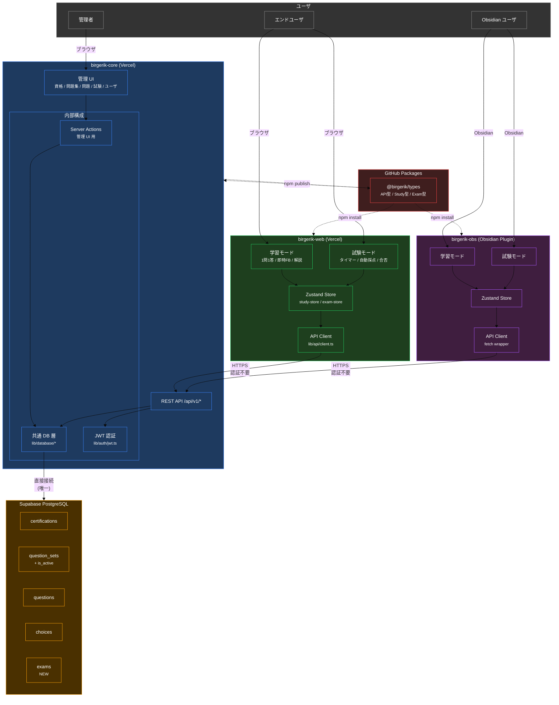

```mermaid
%%{init: {'theme': 'base', 'themeVariables': { 'fontSize': '14px' }}}%%

graph TB
    subgraph Users["ユーザ"]
        Admin["管理者"]
        EndUser["エンドユーザ"]
        ObsUser["Obsidian ユーザ"]
    end

    subgraph Core["birgerik-core  (Vercel)"]
        direction TB
        AdminUI["管理 UI<br/><small>資格 / 問題集 / 問題 / 試験 / ユーザ</small>"]
        API["REST API  /api/v1/*"]

        subgraph CoreInternal["内部構成"]
            direction LR
            SA["Server Actions<br/><small>管理 UI 用</small>"]
            DBLayer["共通 DB 層<br/><small>lib/database/*</small>"]
            Auth["JWT 認証<br/><small>lib/auth/jwt.ts</small>"]
        end

        AdminUI --> SA
        SA --> DBLayer
        API --> Auth
        API --> DBLayer
    end

    subgraph Web["birgerik-web  (Vercel)"]
        direction TB
        StudyUI["学習モード<br/><small>1問1答 / 即時FB / 解説</small>"]
        ExamUI["試験モード<br/><small>タイマー / 自動採点 / 合否</small>"]
        WebStore["Zustand Store<br/><small>study-store / exam-store</small>"]
        WebClient["API Client<br/><small>lib/api/client.ts</small>"]

        StudyUI --> WebStore
        ExamUI --> WebStore
        WebStore --> WebClient
    end

    subgraph Obs["birgerik-obs  (Obsidian Plugin)"]
        direction TB
        ObsStudy["学習モード"]
        ObsExam["試験モード"]
        ObsStore["Zustand Store"]
        ObsClient["API Client<br/><small>fetch wrapper</small>"]

        ObsStudy --> ObsStore
        ObsExam --> ObsStore
        ObsStore --> ObsClient
    end

    subgraph DB["Supabase PostgreSQL"]
        direction LR
        T1["certifications"]
        T2["question_sets<br/><small>+ is_active</small>"]
        T3["questions"]
        T4["choices"]
        T5["exams<br/><small>NEW</small>"]
    end

    subgraph Pkg["GitHub Packages"]
        Types["@birgerik/types<br/><small>API型 / Study型 / Exam型</small>"]
    end

    %% User connections
    Admin -->|"ブラウザ"| AdminUI
    EndUser -->|"ブラウザ"| StudyUI
    EndUser -->|"ブラウザ"| ExamUI
    ObsUser -->|"Obsidian"| ObsStudy
    ObsUser -->|"Obsidian"| ObsExam

    %% API connections
    WebClient -->|"HTTPS<br/>認証不要"| API
    ObsClient -->|"HTTPS<br/>認証不要"| API

    %% DB connection (Core only)
    DBLayer -->|"直接接続<br/>(唯一)"| DB

    %% Package dependencies
    Types -.->|"npm install"| Core
    Types -.->|"npm install"| Web
    Types -.->|"npm install"| Obs

    %% Publish
    Core -.->|"npm publish"| Types

    %% Styles
    classDef coreStyle fill:#1e3a5f,stroke:#3b82f6,color:#fff
    classDef webStyle fill:#1e3f1e,stroke:#22c55e,color:#fff
    classDef obsStyle fill:#3f1e3f,stroke:#a855f7,color:#fff
    classDef dbStyle fill:#4a3000,stroke:#f59e0b,color:#fff
    classDef pkgStyle fill:#3f1e1e,stroke:#ef4444,color:#fff
    classDef userStyle fill:#333,stroke:#888,color:#fff

    class Core,AdminUI,API,CoreInternal,SA,DBLayer,Auth coreStyle
    class Web,StudyUI,ExamUI,WebStore,WebClient webStyle
    class Obs,ObsStudy,ObsExam,ObsStore,ObsClient obsStyle
    class DB,T1,T2,T3,T4,T5 dbStyle
    class Pkg,Types pkgStyle
    class Users,Admin,EndUser,ObsUser userStyle
```
